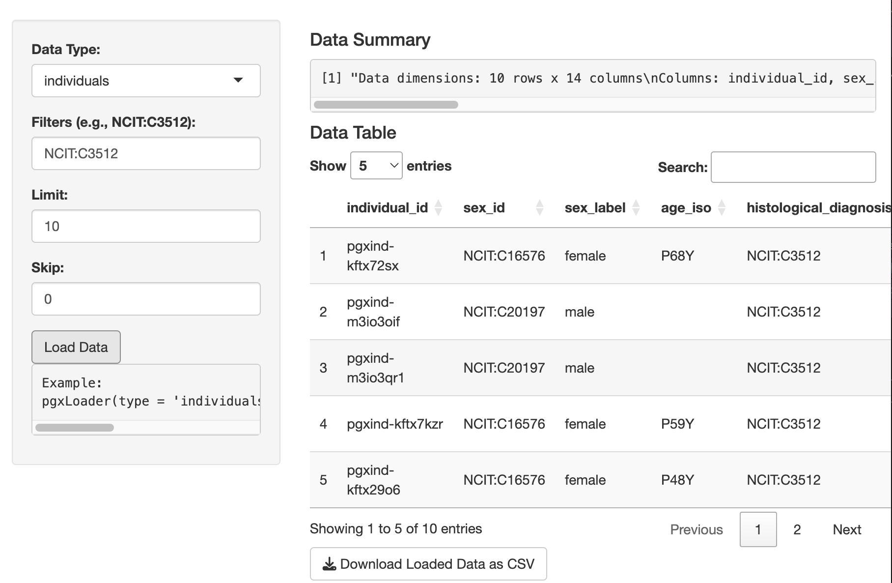

# Progenetix API Explorer Shiny App

An interactive web application for querying, analyzing, and visualizing genomic data from the Progenetix Beacon v2 API and Services.

## 🚀 Features
- Data Loaders: Biosamples, Individuals, Variants, CNV Frequencies
- Metadata and Variant Plotting
- CNV Frequency Analysis (pgxfreq / pgxmatrix)
- CNV Frequency Plotting: Genome-wide, Chromosome, Circos
- Simulated Segment CNV Frequency Calculation
- User Upload and segtoFreq Processing
- Download Capabilities

## 🛠️ Technologies
- R / Shiny
- pgxRpi package
- Progenetix Beacon v2 API
- DT for interactive tables

## 💻 Installation & Usage

# Progenetix API Explorer Tutorial

## 📝 Getting Started Tutorial

### 1. Install R Packages
```r
install.packages(c("shiny", "DT"))
install.packages("devtools")
devtools::install_github("progenetix/pgxRpi")
```

### 2. Launch the App
```r
shiny::runApp("path_to_your_app_directory")
```
Or use the RStudio "Run App" button.

### 3. Using the App

#### Step 1: Load Data
- Select data type: biosamples, individuals, variants, cnv_fraction, etc.
- Set filters or biosample IDs.
- Click "Load Data".
- Preview and download data.

#### Step 2: Metadata Plot
- Set grouping and condition.
- Click "Generate Plot".

#### Step 3: CNV Frequency Loader
- Enter NCIT filters.
- Choose pgxfreq or pgxmatrix.
- Load data and download results.

#### Step 4: CNV Frequency Plot
- Choose plot type: Genome-wide, Chromosome, Circos.
- Set layout.
- Generate plot.

#### Step 5: Simulate or Upload Segment Data
- Simulate example segment data or upload your own.
- Run segtoFreq.
- View and download frequency results.

## 🗃️ Deployment Options
- **shinyapps.io**: Deploy using RSConnect.
- **Shiny Server / Docker**: Follow your platform's deployment guide.


## 📄 License
MIT License. See LICENSE file for details.

## 🤝 Contributing
Feel free to submit issues, pull requests, or feature suggestions.

## 📖 Tutorial
See [tutorial.md](./tutorial.md) for full usage instructions.
